# DroidKaigi 2018 Sample
[](./LICENSE)
[](https://github.com/ohmae/DroidKaigi2018Sample/releases)
[](https://github.com/ohmae/DroidKaigi2018Sample/issues)
[](https://github.com/ohmae/DroidKaigi2018Sample/issues?q=is%3Aissue+is%3Aclosed)

[DroidKaigi 2018](https://droidkaigi.jp/2018/)で説明に使用するサンプルアプリです。

## Author
大前 良介 (OHMAE Ryosuke)
http://www.mm2d.net/

## License
[MIT License](./LICENSE)

# タッチイベントを捕まえよう

AndroidはSDKやSupportLibraryなどが充実しており、基本的なUIであればListenerを登録するだけですべての操作を実装することができます。
しかし、少しこったUIを作ろうとするとどうしても直接タッチイベントをハンドリングする必要が出てきます。
単にドラッグさせるだけ、ならば比較的簡単ですが、ドラッグで移動させることもできるがタップもできるといった複数の操作をお互いをじゃますることなく実現しようとすると、
タッチイベントのハンドリングについて深い理解が必要となります。
MotionEventが保持している情報の読み出し方といった基本的なところから、
複数の操作を違和感なく実現するためのこつを紹介します。

## MotionEventの持つ情報

MotionEventは`View#onTouchEvent`や`OnTouchListener#onTouchEvent`の引数で渡されるクラスですが、このインスタンスが保持する情報について説明します。
MotionEventはタッチのみではなく、ホバーやスタイラスペン、マウス、トラックボールなどの情報も保持しているクラスですが、今回はタッチイベントに関係するところのみ説明していきます。

### 座標情報

座標情報は

```java
float getX()
float getY()
float getX(int pointerIndex)
float getY(int pointerIndex)
```

によって取得することができます。
引数なしでコールすると、一つ目のポインタの座標が取得されます。
マルチタッチを行わない場合は、これを使うだけで終わってしまう場合もあるでしょう。
int値を受け取るメソッドの場合、引数はPointer Indexとなります。
ポインターの数は

```java
int getPointerCount()
```

で取得することができ、Pointer Indexは`0`から`getPointerCount() - 1`までが指定可能です。

注意すべき点は、これらで取得可能な座標は、そのイベントを受け取ったViewにとっての相対座標となっている点です。
絶対座標が必要な場合は

```java
float getRawX()
float getRawY()
```

を使用することで取得することができます。
しかし、こちらはオーバーロードされておらず、一つ目のポインタの値しか取得することはできません。
他の座標情報について絶対座標が必要な場合は、一つ目のポインタの座標情報からoffsetを求めて

```java
void offsetLocation(float deltaX, float deltaY)
```

を使うなどして、offset補正を加えて計算する必要があります。

また、後ほど説明しますが、タッチイベントは通知時点の座標だけでなく、履歴情報も保持しており、それにアクセスするには

```java
float getHistoricalX(int pos)
float getHistoricalY(int pos)
float getHistoricalX(int pointerIndex, int pos)
float getHistoricalY(int pointerIndex, int pos)
```

を使用します。引数一つの場合は一つ目のポインタの情報を取得します。
また、履歴の数は

```java
int getHistorySize()
```

で取得することができます。
`pos`には`0`から`getHistorySize() - 1`までの値を指定することができ、数値が小さい方が古い情報となります。

#### Pointer Index

前述の通り、MotionEventは複数のポインタの座標情報を格納しています。
その各ポインタの情報へのアクセスはPointer Indexを使用してアクセスします。
しかし、このPointer Indexはその時点での各ポインタの情報を配列の先頭から詰め込んだ場合の位置でしかないため、
Pointer Indexをそのままポインタの識別には使用することはできません。
例えば、人差し指、中指の順でタッチした場合、人差し指がindex `0`に、中指がindex `1`に格納されます。
しかし、この後、人差し指を離した場合、人差し指のポインターはなくなりますので、中指の座標情報がindex `0`に格納される事になります。

マルチタッチに対応し、ポインタごとに色を変えてタッチの座標を描画するサンプルを見てみましょう。
[Sample1](https://github.com/ohmae/DroidKaigi2018Sample/blob/master/app/src/main/java/net/mm2d/droidkaigi2018sample/sample1/)

ポインタの塗り分けをindexをもとに行ってみます。

```kotlin
private fun drawTouch(canvas: Canvas, event: MotionEvent) {
    for (i in 0 until event.pointerCount) {
        paint.color = COLORS[i % COLORS.size]
        canvas.drawCircle(event.getX(i), event.getY(i), radius, paint)
    }
}
```

実行すると以下のようになり、一つめのポインタが離れたあと、２つめのポインタの色が変わってしまっています。

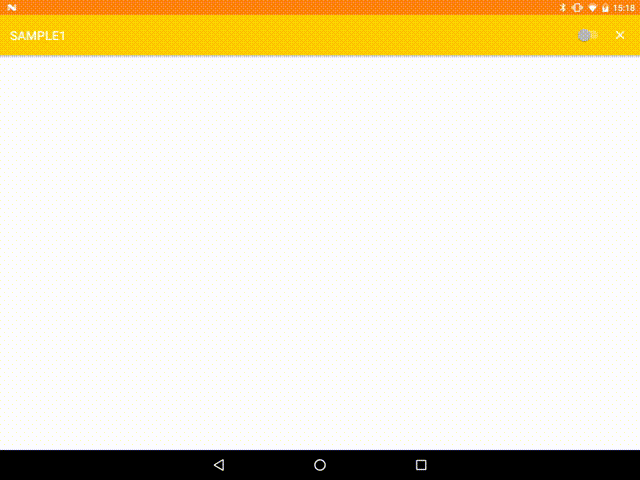

ポインタを識別するには、indexではなく、idを利用します。
IDを利用して塗り分けるには以下のように実装します。

```kotlin
private fun drawTouch(canvas: Canvas, event: MotionEvent) {
    for (i in 0 until event.pointerCount) {
        val id = event.getPointerId(i)
        paint.color = COLORS[id % COLORS.size]
        canvas.drawCircle(event.getX(i), event.getY(i), radius, paint)
    }
}
```

実行すると以下のようになり、一つめのポインタが離れたあとも、２つめのポインタの色は変わりません。

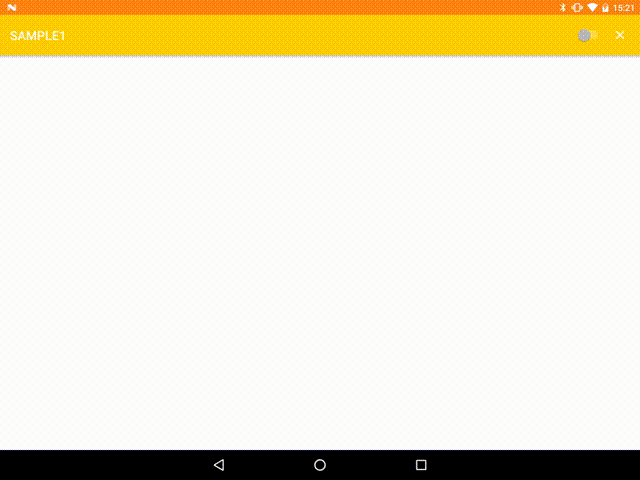

#### タッチイベントの更新頻度

タッチイベントの通知(`View#onTouchEvent()`や`OnTouchListener#onTouch()`コール)は、
タッチセンサーの検出のすべてのタイミングでコールされているわけではなく、一定時間開けて通知が行われます。
MotionEventは前回の通知から、今回の通知までの間に発生した座標情報を保持しています。

履歴の数は

```java
int getHistorySize()
```

で取得することができます。
なお、履歴を保持しているのは`ACTION_MOVE`のときのみでそれ以外の場合は0が戻ります。

UIの操作に利用する場合は、通常最新の情報だけあれば事足りますので、あまり利用するシーンはないかもしれませんが、
ドラッグの軌跡を描画するようなアプリではこの情報を利用しないと、なめらかな軌跡を描くことができません。

履歴を含めて各ポインターの座標を描画させる処理は以下のようになります。

```kotlin
private fun drawTouchWithHistory(canvas: Canvas, event: MotionEvent) {
    val historySize = event.historySize
    for (i in 0 until event.pointerCount) {
        val id = event.getPointerId(i)
        paint.color = COLORS[id % COLORS.size]
        if (historySize == 0) {
            canvas.drawCircle(event.getX(i), event.getY(i), radius, paint)
        } else {
            for (h in 0 until historySize) {
                canvas.drawCircle(event.getHistoricalX(i, h), event.getHistoricalY(i, h), radius, paint)
            }
        }
    }
}
```

Toolbarのスイッチで履歴の有無を切りかえて見せたものが以下になります。

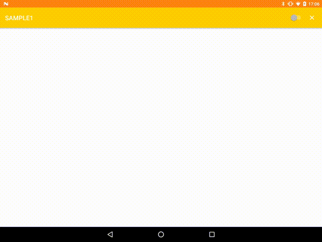

動画キャプチャを行っているため一部イベントを取りこぼしたような動作になっていますが、
点の密度が明らかに違っていることがわかってもらえると思います。

### イベント種別

MotionEventのイベント種別はActionという値で取得します。
Actionの値は
```java
int getAction()
```
で取得することができます。
マルチタッチのハンドリングを行わない場合はこのメソッドでも問題ない場合が多いが、
マルチタッチのイベントはイベントが発生したポインタの情報とのビット和になっているため、後述のメソッドを利用するほうがよいでしょう。

```java
int getActionMasked()
```
イベントが発生したPointer Index情報を除外したAction情報を取得することができる。


```java
int getActionIndex()
```
イベントが発生したPointer Indexを取得することができる。

#### ActionMaskedの値

イベントの種別としては他にもあるが、タッチ操作に関しては以下を理解しておけばよいでしょう。

|イベント|意味|
|:-|:-|
|ACTION_DOWN|タッチ開始：指が触れた|
|ACTION_MOVE|移動|
|ACTION_UP|タッチ終了：指が離れた|
|ACTION_CANCEL|タッチ終了：他にイベントが奪われた|
|ACTION_POINTER_DOWN|2点目以降のタッチ開始|
|ACTION_POINTER_UP|2点以上ある状態でのあるポインタのタッチ終了|

タッチイベントを受け取る処理を書いたことがある人でも、
意外とよくわからず使っている人（ちょっと前の私）がいるだろうイベントはACTION_UPとACTION_CANCELでしょう。

この二つのイベントはともにタッチ操作の終了を意味していますが、
ACTION_UPは指が離れたことによる終了だが、ACTION_CANCELは一連のタッチイベントが他の処理によって消費され場合に通知されるイベントです。
名前の通り、このイベントを受け取っている箇所以外でタッチの処理を開始したため、処理をキャンセルする必要があります。

例えば指を離した時点で判定する操作、例えばタップや、フリックについては
その要件をみ対してる状態であっても、そのイベントを発生させないように終了する必要があります。


#### ドラッグできるView

ここで、以下のようにドラッグできるViewを作ることを考えてみます。
指に追従して動き、指を離すと、それまでの移動速度で慣性動作を行い、徐々に減速しながら止まるというものです。

[Sample2](https://github.com/ohmae/DroidKaigi2018Sample/blob/master/app/src/main/java/net/mm2d/droidkaigi2018sample/sample2/)
にコードがあります。

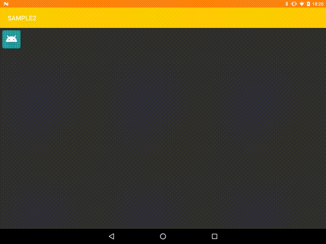

このうち、ドラッグ操作でViewが移動するところだけを抽出すると以下のようになります。


```kotlin
private fun onTouch(view: View, event: MotionEvent): Boolean {
    when (event.actionMasked) {
        MotionEvent.ACTION_MOVE ->
            moveOffset(view, event.rawX - prevX, event.rawY - prevY)
        }
    }
    prevX = event.rawX
    prevY = event.rawY
    return true
}

private fun moveOffset(v: View, dx: Float, dy: Float) {
    v.translationX = v.translationX + dx
    v.translationY = v.translationY + dy
}
```

ACTION_MOVEにて、直前のtouch座標からの移動分をtranslationX/translationYに加算することで移動を実現しています。
使用する座標は getX() / getY() ではうまくいきません。
View自体が移動しているため、相対座標の基準が動いてしまうためです。
このような場合、 getRawX() / getRawY() を使用します。

## ドラッグ速度の計算

前述のドラッグできるViewにて、指を離した後、それまでの移動速度を維持しつつ慣性動作を行っています。
慣性動作のためのそれまでのタッチイベントの移動速度を求めたい場合、
[VelocityTracker](https://developer.android.com/reference/android/view/VelocityTracker.html)
を利用するのが簡単です。

速度計算だけを抽出すると以下のような感じで使います。

```kotlin
fun onTouch(view: View, event: MotionEvent): Boolean {
    val tracker = velocityTracker ?: VelocityTracker.obtain()
    velocityTracker = tracker
    tracker.addMovement(event)
    when (event.actionMasked) {
        MotionEvent.ACTION_UP -> {
            tracker.computeCurrentVelocity(FRAME_INTERVAL)
            velocityX = tracker.xVelocity
            velocityY = tracker.yVelocity
            tracker.recycle()
            velocityTracker = null
        }
    }
    return true
}
```

VelocityTrackerはインスタンスを使い回す仕組みがありますので、タッチの開始で `obtain()` でインスタンスを取得し、
タッチの終了で `recycle()` をコールし、インスタンスを解放します。

……ですが、これではうまくいきません。

先に説明したとおり、MotionEventの座標情報はViewの相対座標になっています。
View自体をタッチ座標の変化に合わせて移動させていますので、その座標の変化量を計算しても速度にはなりません。

MotionEventの座標を絶対座標に補正した上で利用する必要があります。

補正の方法としては以下のようにMotionEventのコピーを作成した上で`offsetLocation()`で絶対座標に戻して利用する。

```kotlin
MotionEvent.obtain(event).let {
    it.offsetLocation(event.rawX - event.x, event.rawY - event.y)
    tracker.addMovement(it)
    it.recycle()
}
```

今回の場合は、VelocityTrackerに渡すところだけ補正すればいいので以下のような方法でもよいでしょう。

```kotlin
val dx = event.rawX - event.x
val dy = event.rawY - event.y
event.offsetLocation(dx, dy)
tracker.addMovement(event)
event.offsetLocation(-dx, -dy)
```

いずれにせよ、MotionEventはこのあとも他のViewなどへ伝搬していくものなので、
座標の変換を行う場合は、影響が出ないようにコピーに対して行うか、返還後元に戻すかが必要となります。

## タップとは何か？

前項で出てきたドラッグできるViewに対して、タップの判定もできるようにしてみましょう。

簡単ですね。OnClickListenerを登録して

```kotlin
icon.setOnClickListener { _ ->
    Toast.makeText(this, "clicked", Toast.LENGTH_SHORT).show()
}
```

では動かしてみましょう。

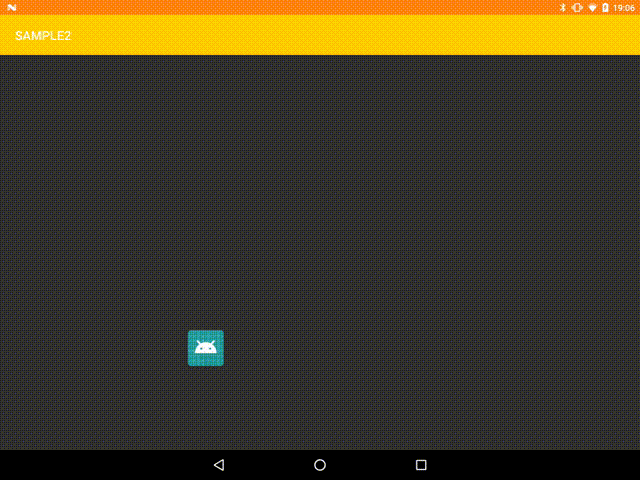

はい、ダメですね。
ドラッグしたのにタップ判定をしてしまっています。

これをうまく判定するためには、そもそもタップとは何か？を理解する必要があります。

### タップとはなんだろう？

タップというものがどういう操作なのかはわかっていても、その厳密な定義は何か？は以外と皆さん知らないものです。

指をちょんと触れて離す。一定時間より短くないといけなさそう？ドラッグみたいに指が触れている間に移動が発生してはいけない？

なんとなくそんな認識だったりするのではないでしょうか？

では正解を言うと、「指が触れてから離れるまでの間に、他のイベントにタッチイベントが消費されなかった」このときタップと判定します。

時間とか、動く距離とかは関係ありません。
例えばAndroidでは500ms以上指を押しつけたままにしておくとLongClickとなります。
もちろんLongClickのイベントが消費された場合は、そのあと指が離れてもタップではありません。
ですが、LockClickのイベントが消費されていない場合、OnLongClickListenerが登録されていない場合は、
500ms以上指を押しつけた後指を離してもタップとなります。
ドラッグも同様です。ドラッグ操作が判定されて、そこでイベントが消費されない場合は、指を動かした後で指を離してもタップと判定されます。

さて、今回の例の場合、ドラッグできるViewをタップできるようにしようとしていますので、
指が触れてから離すまでの間、ドラッグが発生しない場合にタップと判定するようにすればよいのです。

ただ、その場合、ドラッグが発生していない状態をどう判定するかという問題が出てきます。

ACTION_MOVEが発生しないなどとしてしまうとうまくいきません。どんな短時間のタップでもACTION_MOVEが発生しない訳ではありません。
端末によっては発生しない場合もあったりするあたりがややこしくしていますが、
通常人間が単にタップしただけの操作でもわずかなポインタの移動は発生しうるものなので、
それを許容するようにしておかないと、タップするのが難しい、とか、端末や人によってタップできないとかいう状態になってしまいます。

こういう操作のスレッショルドの基準となる情報は
[ViewConfiguration](https://developer.android.com/reference/android/view/ViewConfiguration.html)
を利用することで取得できます。


この辺の処理を抽出するとこんな感じになります。

```kotlin
private val touchSlopSquare by lazy {
    val touchSlop = ViewConfiguration.get(this).scaledTouchSlop
    touchSlop * touchSlop
}

private fun onTouch(view: View, event: MotionEvent): Boolean {
    when (event.actionMasked) {
        MotionEvent.ACTION_DOWN -> {
            dragging = false
            startX = event.rawX
            startY = event.rawY
        }
        MotionEvent.ACTION_MOVE ->
            if (dragging) {
                moveOffset(view, event.rawX - prevX, event.rawY - prevY)
            } else if (calculateDistanceSquare(event.rawX - startX, event.rawY - startY) > touchSlopSquare) {
                dragging = true
            }
        MotionEvent.ACTION_UP -> {
            if (!dragging) {
                Toast.makeText(this, "Tapped", Toast.LENGTH_SHORT).show()
            }
        }
    }
    prevX = event.rawX
    prevY = event.rawY
    return true
}
```

タッチの開始から移動距離が `scaledTouchSlop` を超えるまではドラッグを発生させないようにしています。
ドラッグが発生する前に `ACTION_UP` に到達した場合にタップと判定します。

さて、これでタップ判定をさせたものが以下になります。


ちゃんと、ドラッグの時には反応しないで、タップに対して反応できています。


なお、前述の計算で距離をそのまま計算するのではなく、
自乗和と距離の自乗を比較しているのは、平方根の計算はコストが高いためです。
タッチイベントは1秒のうちに何度も呼ばれる処理なので、計算コストを下げるようにしましょう。

## タッチイベントの伝搬

タッチイベントを受け付けるメソッドには以下のようなものがあります。

- Activity
  - `dispatchTouchEvent()`
  - `onTouchEvent()`
- ViewGroup
  - `dispatchTouchEvent()`
  - `onInterceptTouchEvent()`
  - `onTouchEvent()`
- View
  - `dispatchTouchEvent()`
  - `onTouchEvent()`

View#OnTouchListenerは？という疑問もあるかもしれませんが、
OnTouchListenerについては、View/ViewGroupのonTouchEvent()と同じだと思っていただければよいです。
より厳密にはOnTouchListenerが登録されているとonTouchEventより優先してOnTouchListener#onTouchがコールされますが、どちらも役割的には同じです。

これらのメソッドの関係は以下のような関係になっています。

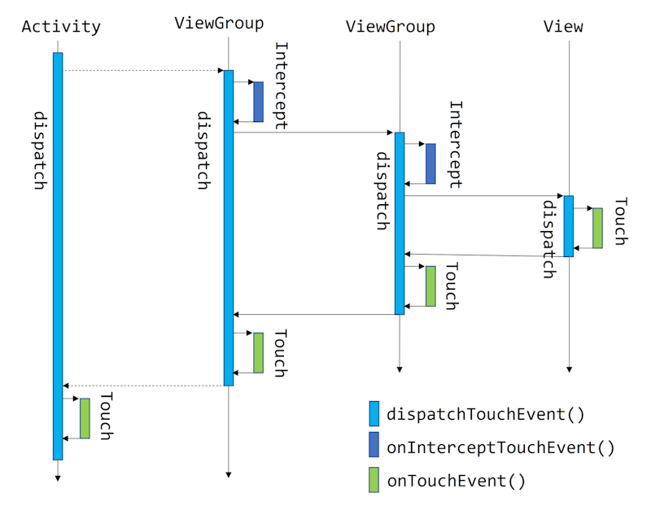

ActivityからViewGroupの間は実装が隠蔽されていますが最終的にはつながっています。

`dispatchTouchEvent()`はここで説明するタッチイベントの伝搬の仕組みをになっているメソッドですので、
overrideして実装を完全に書き換えるということは通常やらないと思います。

`onTouchEvent()`と`onInterceptTouchEvent()`の使いこなしが重要になってきます。

### onTouchEvent()

`onTouchEvent()`に着目してみますと、タッチイベントは一番上のレイヤーから順次下へイベントが伝搬していく仕組みになっています。

ただし、これはすべてのメソッドがコールされるわけではありません。
`ACTION_DOWN`のイベントにおいて、`true`を返すメソッドまでがコールされます。
`true`を返した階層以下の`onTouchEvent()`はコールされません。
それ以降のイベント（`ACTION_UP` or `ACTION_CANCEL`まで）では`ACTION_DOWN`で`true`を返した階層の`onTouchEvent()`だけがコールされるようになります。
`ACTION_DOWN`以外のイベントでは`true`を返しても`false`を返しても変わりありません。

ポイントとしては`ACTION_DOWN`でtrueを返しておかないと後のイベントを受け取ることができないということです。
仮に`ACTION_UP`だけを受け取りたいという場合であっても`ACTION_DOWN`でtrueを返しておく必要があります。

### onInterceptTouchEvent()

次は、`onInterceptTouchEvent()`に着目してみます。
これは、子Viewを持ちうるViewGroupのサブクラスにしかないメソッドです。
`onTouchEvent()`とは逆に、下位レイヤーから順にコールされていきます。
コールされる条件は、その階層より上位レイヤーの`onTouchEvent()`がコールされる場合となります。
ただし、`ACTION_DOWN`の場合は子Viewが存在しない場合でもコールされます。

このメソッドはその名の通り、子Viewに伝搬されていくタッチイベントを途中で奪い取るために使います。

`false`を返すと何も発生しませんが、`true`を返した時点で子Viewへ受け渡されるタッチイベントを
自分の`onTouchEvent()`へ流し始めることができます。

その処理は、タッチイベントの「途中」か否かで変わってきます。
すなわち、`ACTION_DOWN`の時とそれ以外で違います。

`ACTION_DOWN`の場合：
- 子Viewの`dispatchTouchEvent()`はコールされず、自身の`onTouchEvent()`がコールされます。

`ACTION_DOWN`以外の場合：
- 子Viewへは`ACTION_CANCEL`が伝えられます。また、このイベントでは自身の`onTouchEvent()`がコールされません。

`true`を返した次のイベントからは、そのViewの`onInterceptTouchEvent()`はコールされず、子Viewの`dispatchTouchEvent()`もコールされません。
そのViewの`onTouchEvent()`がコールされるようになります。

`ACTION_DOWN`については`onInterceptTouchEvent()`/`onTouchEvent()`両方で受け取る可能性があります。
（`onInterceptTouchEvent()`がtrueを返した場合、子Viewが`onTouchEvent()`で`false`を返した場合）

逆に、`ACTION_DOWN`以外でタッチイベントを奪った場合、
`onTouchEvent()`は`ACTION_DOWN`なしで、途中からタッチイベントをうけとることになります。
`onInterceptTouchEvent()`でやるべき処理と、`onTouchEvent()`でやるべき処理は、一部オーバーラップするため、よく考える必要があります。

また、先に説明した`ACTION_CANCEL`が伝搬されるシーンも出てきました。
このように、`ACTION_DOWN`を渡してしまったが途中で他にイベントを奪われる場合に、
始めてしまった処理をキャンセルしなければならない場合に送られるActionなのです。
そのため、`ACTION_CANCEL`で`ACTION_UP`と同じ処理をしてしまってはいけないのです。

### 問題：ここだけ触れるようにして

下の画面を見てください。
[Sample3](https://github.com/ohmae/DroidKaigi2018Sample/blob/master/app/src/main/java/net/mm2d/droidkaigi2018sample/sample3/)
新機能の紹介でよく使われる表現です。

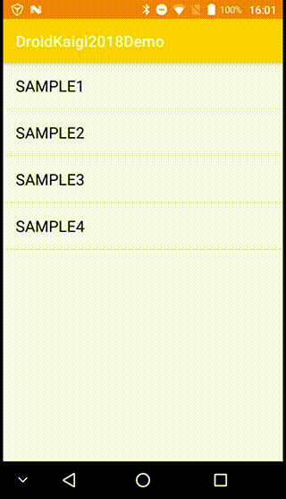

この画面の青い円の真ん中に開いた穴の中、
つまり訴求しているボタンのみをそのまま押せるようにして、
他の部分は触っても下のボタンが反応しないようにしたい。
ということはよくあると思います。

これまでの経緯を踏まえるとどうすればいいかすぐにわかると思います。

オーバーレイ表示しているViewで以下のようにします。

```kotlin
override fun onTouchEvent(event: MotionEvent): Boolean {
    val dx = event.x - centerX
    val dy = event.y - centerY
    return calculateDistanceSquare(dx, dy) >= holeRadiusSquare
}

fun calculateDistanceSquare(x: Float, y: Float): Float {
    return x * x + y * y
}
```
こんな感じで、タップされた座標が穴の中なら`false`を返し、外なら`true`を返すようにすると、
穴の中を触ったときだけ、その下位レイヤーのViewへタッチイベントが伝搬しますので、タップに反応するようになります。
穴の外を触った場合はこのオーバーレイViewでイベントを消費してしまうため、下位レイヤーのViewは反応しません。

### 問題：ドラッグ操作を受け取り、子Viewの位置を動かすViewGroup、子Viewは`OnClickListener`を登録可能

[Sample4](https://github.com/ohmae/DroidKaigi2018Sample/blob/master/app/src/main/java/net/mm2d/droidkaigi2018sample/sample4/)
ちょっとややこしいですが、以下の画面のようなものを考えます。

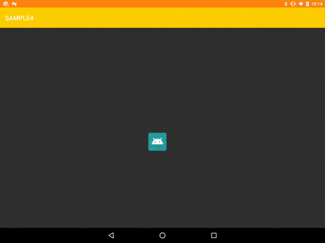

Sample2と似ていますが、ドラッグに伴うタッチイベントをハンドリングしているのはアイコンの方ではなく、
それを内包しているViewGroupです。なので、アイコンの外をドラッグしてもアイコンが動きます。
そして、アイコンをタップすることができるのですが、
これはアイコンへ`OnClickListener`を登録することで実現します。

つまり、タッチを受け取って子Viewを動かせるような汎用的なViewGroupを考えた場合、
それ以外の操作については子View側にやってもらうようにして、子Viewがどう動くかにかかわらず機能を提供できるようにした方がいいでしょう。

その実現方法について考えてみます。

- タッチのイベントをすべてViewGroupで受け取るようにしてしまうと、
子Viewへタッチイベントが送られなくなってしまう。
つまり、少なくともドラッグと判定するまでのイベントについては子Viewへ渡す必要があります。
- 子Viewはタッチイベントを消費するかどうかわかりません、
  - 消費された場合は、ViewGroupの`onTouchEvent()`はコールされません。ドラッグ状態かどうかの判定は`onInterceptTouchEvent()`で行わなければなりません。
  - 消費しない場合は、ViewGroupの`onTouchEvent()`がコールされます。しかし、ドラッグ状態でない場合も、ここで`true`を返しておかないとイベントを受け取れなくなってしまいます。

以上のようなことを考えて以下のようにします。

`onInterceptTouchEvent()`ではドラッグ状態になったかどうかを判定し、ドラッグ状態になった場合に`true`を返すようにします。
`true`を返した後は`onInterceptTouchEvent()`はコールされなくなるのでその後について考える必要はありません。

```kotlin
override fun onInterceptTouchEvent(event: MotionEvent): Boolean {
    when (event.actionMasked) {
        MotionEvent.ACTION_DOWN -> {
            dragging = false
            startX = event.rawX
            startY = event.rawY
        }
        MotionEvent.ACTION_MOVE ->
            if (calculateDistanceSquare(event.rawX - startX, event.rawY - startY) > touchSlopSquare) {
                dragging = true
            }
    }
    prevX = event.rawX
    prevY = event.rawY
    return dragging
}
```

`onTouchEvent()`ではドラッグ状態になる前にコールされる可能性もあるので、
`onInterceptTouchEvent()`で行っている、ドラッグ状態かどうかの判定をこちらでも行う必要があります。
ただし、`ACTION_DOWN`については`onInterceptTouchEvent()`側が必ずコールされますので、
処理を変更する必要がないのであれば拾う必要はありません。
ここまで来た場合は必ずイベントを受け取るようにする必要がありますので、戻り値は`true`にします。

```kotlin
override fun onTouchEvent(event: MotionEvent): Boolean {
    when (event.actionMasked) {
        MotionEvent.ACTION_MOVE -> {
            if (dragging) {
                moveOffset(event.rawX - prevX, event.rawY - prevY)
            } else if (calculateDistanceSquare(event.rawX - startX, event.rawY - startY) > touchSlopSquare) {
                dragging = true
            }
        }
    }
    prevX = event.rawX
    prevY = event.rawY
    return true
}
```

## ピンチとは何か？

以下のようなドラッグでき、縦横方向を独立して拡大縮小できるグリッドを考えます。
[Sample5](https://github.com/ohmae/DroidKaigi2018Sample/blob/master/app/src/main/java/net/mm2d/droidkaigi2018sample/sample5/)

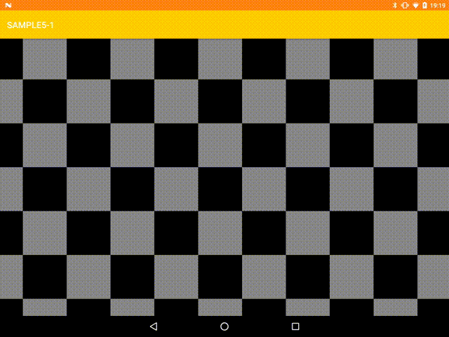

広大なマップの一部を拡大して見せる窓をイメージしていただければいいと思います。
これの表示パラメータは窓の左上の座標(x, y)と、一つのマス目の縦横の大きさ(scaleX, scaleY)の4つです。

### ピンチによるスケール操作

ピンチによるスケール操作を行いたい場合、
[ScaleGestureDetector](https://developer.android.com/reference/android/view/ScaleGestureDetector.html)
というクラスを使うのが便利です。

スケール操作を行うと
[OnScaleGestureListener](https://developer.android.com/reference/android/view/ScaleGestureDetector.OnScaleGestureListener.html)
に通知が来ます。リスナーの引数に`ScaleGestureDetector`のインスタンスが含まれていますので、
`ScaleGestureDetector`からスケールに関するパラメータを読み出して処理を行います。

```java
float getScaleFactor()
```

これは拡大率の変化を受け取ります。
縦横の拡大率を同一にしている場合はこちらを利用すればよいでしょう。
しかし、今回の例では縦横の拡大率を独立して設定できるようにしていますので

```java
float getCurrentSpanX()
float getCurrentSpanY()
float getPreviousSpanX()
float getPreviousSpanY()
```

を利用して、縦横の拡大率の変化を計算します。

`ScaleGestureDetector`ではこんな感じで、縦横の拡大率の変化を計算して

```kotlin
val scaleDetector = ScaleGestureDetector(this, object : SimpleOnScaleGestureListener() {
    override fun onScale(detector: ScaleGestureDetector): Boolean {
        val scaleFactorX = detector.currentSpanX / detector.previousSpanX
        val scaleFactorY = detector.currentSpanY / detector.previousSpanY
        gridMap.gridMapContext.onScaleControl(scaleFactorX, scaleFactorY)
        gridMap.invalidate()
        return true
    }
})
```

以下のようにパラメータに反映させます。

```kotlin
internal fun onScaleControl(scaleFactorX: Float, scaleFactorY: Float) {
    scaleX = clamp(scaleX * scaleFactorX, scaleXMin, scaleXMax)
    scaleY = clamp(scaleY * scaleFactorY, scaleYMin, scaleYMax)
    ensureGridRange()
}
```

これで動かしてみましょう。

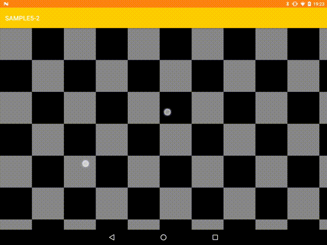

ちょっと思ったのと違いますね。

#### スケール操作の中心を考慮

通常ピンチ操作を行った場合は、指を広げたその中心から広がるような動作を期待すると思います。

操作の中心は`ScaleGestureDetector`から取得することができます。

```java
float getFocusX()
float getFocusY()
```

ではこのパラメータを利用してこんな風に拡大率を反映させてみましょう

```kotlin
val scaleDetector = ScaleGestureDetector(this, object : SimpleOnScaleGestureListener() {
    override fun onScale(detector: ScaleGestureDetector): Boolean {
        val scaleFactorX = detector.currentSpanX / detector.previousSpanX
        val scaleFactorY = detector.currentSpanY / detector.previousSpanY
        gridMap.gridMapContext.onScaleControl(detector.focusX, detector.focusY, scaleFactorX, scaleFactorY)
        gridMap.invalidate()
        return true
    }
})
```

拡大率の変化にともなって発生する操作の中心座標の移動量を計算し、その分逆方向に移動させることで
操作の中心が移動せず、そこを中心に拡大縮小が行われているように見せることができます。

```kotlin
internal fun onScaleControl(focusX: Float, focusY: Float, scaleFactorX: Float, scaleFactorY: Float) {
    val newScaleX = clamp(scaleX * scaleFactorX, scaleXMin, scaleXMax)
    val newScaleY = clamp(scaleY * scaleFactorY, scaleYMin, scaleYMax)
    x -= focusX / newScaleX - focusX / scaleX
    y -= focusY / newScaleY - focusY / scaleY
    scaleX = newScaleX
    scaleY = newScaleY
    ensureGridRange()
}
```

さて、動きを見てみましょう。

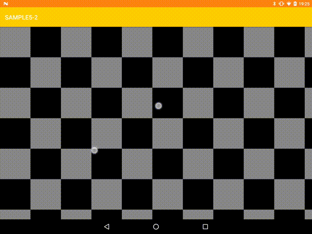

なかなかいい感じですね。

では、ちょっと意地悪をして、片方の点を動かさず、もう一つの点の移動のみのピンチ操作を行ってみましょう。

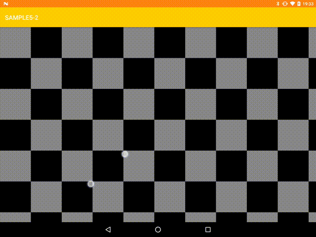

ちょっとまだ違和感がありますよね。
理想としては、抑えている点はグリッドに対して動かない、各点のグリッドに対する相対位置が固定されたような動きになってほしいところです。

上の例では少し極端ではありますが、通常のピンチ操作でも、例えば、人差し指と親指でのピンチを行った場合、通常、人差し指の方の移動量の方が多いはずです。
この、ピンチ操作の各点の移動量が均一ではないということへの配慮が必要となります。

では、どうすればいいかですが、ピンチによる移動成分を考慮します。
すこしわかりにくいかもしれませんが、以下のように2点の移動量が違っていると、中心座標が移動しています。
この中心座標の移動分、グリッドも移動させてやる必要があります。
```
  ○--●--○
○--------●--------○
```

さて、それを実現する場合、`ScaleGestureDetector`では少し機能不足です。
現在の中心座標を受け取ることは可能ですが、以前の中心座標の情報はありません。
また、移動を通知するものではないため、スケール操作以外の通知を受け取ることができません。

方法としては

+ [GestureDetector](https://developer.android.com/reference/android/view/GestureDetector.html)を利用し、`onScroll()`で移動を行う。
+ 拙作[MultiTouchGestureDetector](https://github.com/ohmae/DroidKaigi2018Sample/blob/master/app/src/main/java/net/mm2d/droidkaigi2018sample/sample5/MultiTouchGestureDetector.kt)を利用する。

どちらでも同じですが、`MultiTouchGestureDetector`は今回の操作に特化して作成したことと、
実装を読みやすく作ったので具体的な処理を紹介します。

やっていることは簡単なベクトル計算です。

はじめに全ポインタの中心座標を求めます。
次に、その中心座標から全座標へのX座標、Y座標それぞれの距離の平均を求めます。

この距離の変化が拡大率の変化となります。

中心座標の移動と拡大率の変化を通知します。

```kotlin
private fun handleMotionEvent(event: MotionEvent, notify: Boolean, excludeActionPointer: Boolean = false) {
    val count = event.pointerCount
    val skipIndex = if (excludeActionPointer) event.actionIndex else -1
    val div = if (excludeActionPointer) count - 1 else count

    // ポインタの中心座標を求める
    var sumX = 0f
    var sumY = 0f
    for (i in 0 until count) {
        if (i == skipIndex) continue
        sumX += event.getX(i)
        sumY += event.getY(i)
    }
    val focusX = sumX / div
    val focusY = sumY / div

    // 中心座標から各ポインタへの距離の平均をピンチ操作の基準値とする
    var devSumX = 0f
    var devSumY = 0f
    for (i in 0 until count) {
        if (i == skipIndex) continue
        devSumX += Math.abs(focusX - event.getX(i)) / div
        devSumY += Math.abs(focusY - event.getY(i)) / div
    }
    val spanX = devSumX / div * 2
    val spanY = devSumY / div * 2

    if (notify) {
        val scaleX = if (prevSpanX < minimumSpan) 1.0f else spanX / prevSpanX
        val scaleY = if (prevSpanY < minimumSpan) 1.0f else spanY / prevSpanY
        val dX = focusX - prevFocusX
        val dY = focusY - prevFocusY
        mListener.onMove(dX, dY)
        if (scaleX != 1.0f || scaleY != 1.0f) {
            mListener.onScale(focusX, focusY, scaleX, scaleY)
        }
    }
    prevSpanX = spanX
    prevSpanY = spanY
    prevFocusX = focusX
    prevFocusY = focusY
}
```

さて、中心座標の移動を含めたバージョンで先ほどと同じような操作をしてみましょう。


点とグリッドの相対位置が変化しないピンチ操作になっていますね。

ピンチ操作とドラッグを同時に行うと

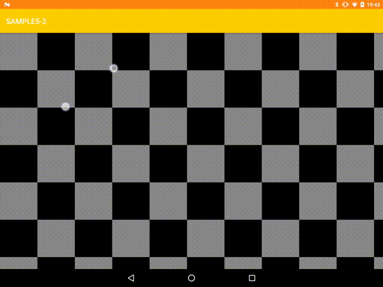

この場合もちゃんとドラッグとピンチ両方が直感に反しない動きになっています。

では、指が2本ではなく3本以上あった場合はどうするか、ですが、
先ほど照会した処理がすでに、点の数を2個に限定していませんでした。
つまり、同じ処理で指を3本以上使ったピンチ操作を行っても、同様に直感的な動きを見せてくれます。

指3本の場合

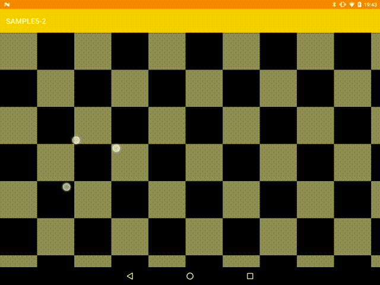

指4本の場合

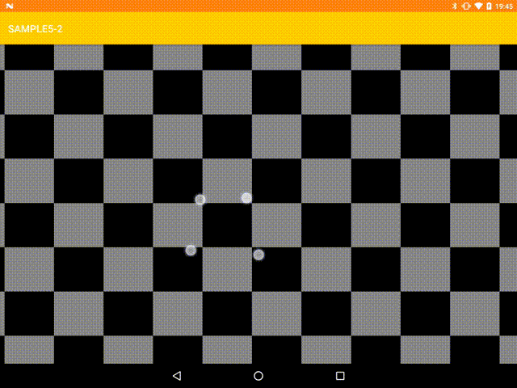

どうでしょう？いい感じに動いてくれるでしょう？

## まとめ

タッチイベントの基本から、実際にユーザの操作を判定する方法を解説してきました。

タッチイベントのハンドリングを注意深く行うことで、複数の動作を違和感なく実現することができます。
しかし、実装コード自体はそれほど長大なものではなかったと思います。

違和感なく操作できるUIはUXを高めてくれます。
工夫して、もっと「気持ちいい」UIを作りましょう！
